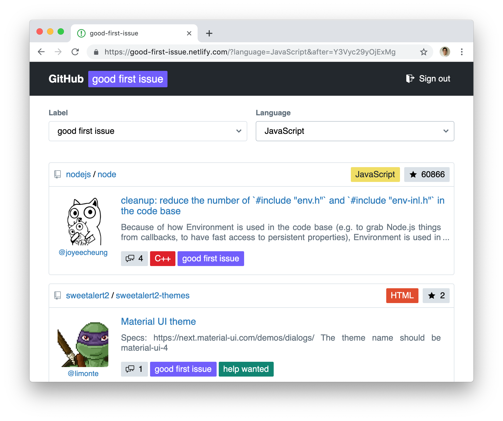

# good-first-issue

> Yet another "good first issue" finder on GitHub

[](https://good-first-issue.netlify.com)

## Build Setup

```bash
# install dependencies
$ npm install

# serve with hot reload at localhost:3000
$ npm run dev

# build for production and launch server
$ npm run build
$ npm start

# generate static project
$ npm run generate
```

For detailed explanation on how things work, checkout [Nuxt.js docs](https://nuxtjs.org).

## Development

This project is built on Netlify and Firebase Authentication using GitHub.

### Environmental variables

Set the following environmental variables.

- `NUXT_ENV_FIREBASE_API_KEY`
- `NUXT_ENV_FIREBASE_PROJECT_ID`

## License

[MIT](https://choosealicense.com/licenses/mit/)
